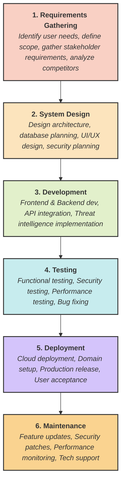

# Task #03 – Waterfall Models and Product Development

**Product Name:** SpiderVision Intelligence – Social Media Threat Intelligence Platform

**Product Description:**
SpiderVision Intelligence is a platform designed to collect Open Source Intelligence (OSINT), analyze social media profiles, detect suspicious activities, identify fake accounts, and generate intelligence reports for cybersecurity professionals and investigators.

> **Note:** As previously established, this assignment utilizes natively supported Mermaid.js to beautifully render the Waterfall Model diagram directly on GitHub instead of linking to an inaccessible Lucidchart document.

---

## Waterfall Development Model Flowchart

---

### Attached Files
A Word document detailing the phases and content has been generated and included in this repository folder: `Waterfall Product Development.docx`.
